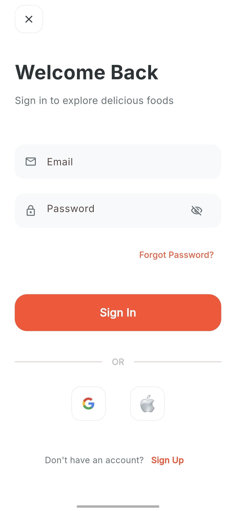
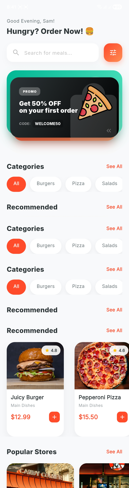
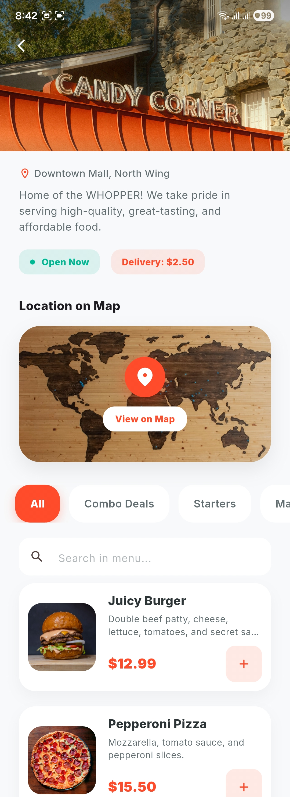
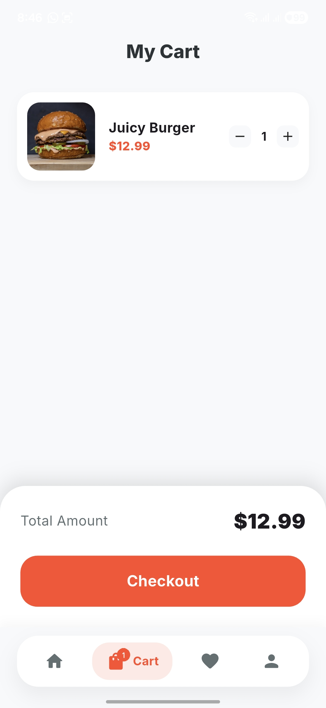
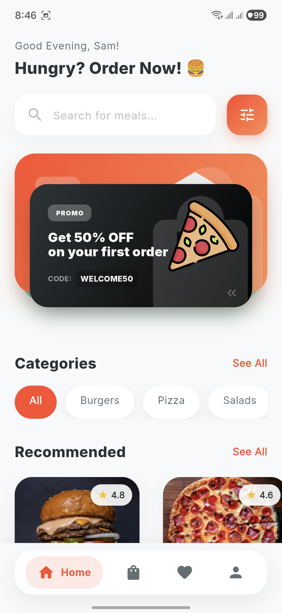

# 🥂 FoodShop UI — Premium Food & Grocery Experience

[](https://flutter.dev)
[](https://pub.dev/packages/provider)
[](https://pub.dev/packages/shared_preferences)
[](LICENSE)
[](CONTRIBUTING.md)
[](https://github.com/Qharny/FoodHub-UI-Kit)

A high-fidelity, **open-source Flutter UI template** for a seamless food and grocery shopping experience. Built with modern aesthetics, fluid animations, and robust functionality — all powered by local storage for a zero-backend configuration.

> 🎯 **This is a UI Kit / Starter Template.** Fork it, customize it, and ship your own food app. Contributions are warmly welcomed!

---

## 📽️ App Walkthrough

Experience the fluid animations and premium UI in action:

<!-- 
  HOW TO ADD YOUR VIDEO:
  Option 1 (Recommended): Go to GitHub.com → open this file for editing → drag & drop your .mp4 into the editor. GitHub hosts it and embeds it automatically.
  Option 2: Upload to YouTube or Loom, replace the URL below, and use a thumbnail image.
-->

<p align="center">
  <video src="https://vt.tiktok.com/ZSHrG1NAX/" width="400" autoplay loop muted playsinline></video>
</p>

---

## ✨ Features

### 🎨 Visual Excellence
- **Deeply Immersive Dark Mode** — Full system-aware dark theme support with curated surface and background color tokens.
- **Interactive Shuffle Banner** — A custom 3D card shuffle interaction for featured promotions, replacing traditional carousels with elastic physics and parallax effects.
- **Micro-interactions** — Subtle bounce animations, hover effects, and spring-based transitions for a premium tactile feel.
- **Dynamic Greeting** — Personalized time-based greetings (Good Morning, Afternoon, Evening).

### 🍔 Advanced Ordering
- **Complex Customization** — Multi-select toppings (checkboxes) and exclusive choices (radio buttons) with real-time price calculation.
- **Special Instructions** — Direct-to-kitchen notes for highly personalized orders.
- **Smart Cart System** — Intelligent grouping of items based on customization; unique configurations are treated as separate line items.

### 🔐 Core Functionality
- **Local User Management** — Secure local authentication and session management using `SharedPreferences`.
- **Wishlist Management** — Personalized "Favorites" section with animated state persistence.
- **Global Tab State** — Unified navigation shell for seamless switching between Home, Cart, Favorites, and Profile.
- **Categorized Discovery** — Quick-filter items by category (Burger, Pizza, and more).

---

## 🎨 Screens

### 🔐 Authentication Flow

Secure, local-only authentication system. Sessions are persisted using `SharedPreferences`.

| Sign Up | Login |
| :---: | :---: |
|  |  |

### 🏠 Discovery Experience

The home screen is optimized for lightning-fast scrolling, built on a `CustomScrollView` with Sliver architecture.



### 🍔 Marketplace & Recommendations

| Stores | Recommendations |
| :---: | :---: |
|  |  |

### 🛒 Shopping Experience

| Cart | Navigation Bar |
| :---: | :---: |
|  |  |

---

## 🛠️ Tech Stack

| Layer | Technology |
| --- | --- |
| **Framework** | [Flutter](https://flutter.dev) (v3.22+) |
| **State Management** | [Provider](https://pub.dev/packages/provider) — Cart, Theme, Tab, Favorites |
| **Local Storage** | [SharedPreferences](https://pub.dev/packages/shared_preferences) — Sessions & Auth |
| **Image Handling** | [Cached Network Image](https://pub.dev/packages/cached_network_image) |
| **Typography** | [Google Fonts — Inter](https://fonts.google.com/specimen/Inter) |

### 📈 Performance Optimizations

- **Lazy Loading** — Screens are instantiated only when first visited to reduce startup lag.
- **Memory Caching** — Images are automatically resized in memory based on display dimensions.
- **Micro-Builds** — Complex widgets are isolated into separate classes to prevent full-screen rebuilds.
- **Sliver Architecture** — `CustomScrollView` used for efficient home screen layout management.

---

## 🚀 Getting Started

### Prerequisites
- Flutter SDK (Stable channel, v3.22+)
- Dart SDK

### Installation

1. **Clone or use this template:**

   Click **"Use this template"** on GitHub, or clone directly:
   ```bash
   git clone https://github.com/Qharny/FoodHub-UI-Kit.git
   cd FoodHub-UI-Kit
   ```

2. **Install dependencies:**
   ```bash
   flutter pub get
   ```

3. **Run the app:**
   ```bash
   flutter run
   ```

---

## 📂 Project Structure

```text
lib/
├── models/         # Data structures (FoodItem, Topping, CartItem, LocalUser)
├── providers/      # Application state (Cart, Favorites, Tab, Theme)
├── screens/        # UI Layers (Home, Main Shell, Details, Profile)
├── services/       # Logic (AuthService, Persistence)
├── utils/          # Formatting, Colors, Constants, and Mock Data
└── widgets/        # Component Library (AppImage, FoodCard, ShuffleBanner)
```

---

## 🤝 Contributing

Contributions are what make open source amazing. Any contributions you make are **greatly appreciated**!

### How to Contribute

1. **Fork** the repository
2. **Create** your feature branch:
   ```bash
   git checkout -b feature/AmazingFeature
   ```
3. **Commit** your changes:
   ```bash
   git commit -m 'Add some AmazingFeature'
   ```
4. **Push** to your branch:
   ```bash
   git push origin feature/AmazingFeature
   ```
5. **Open a Pull Request** — describe what you've added or changed.

### What You Can Contribute
- 🐛 Bug fixes
- 🎨 New screen designs or UI components
- 🌍 Localization / i18n support
- ♿ Accessibility improvements
- 🧪 Widget tests and integration tests
- 📦 Backend integration examples (Firebase, Supabase, etc.)
- 📖 Documentation improvements

Please read our [CONTRIBUTING.md](CONTRIBUTING.md) for full guidelines.

---

## 🗺️ Roadmap

- [ ] Firebase / Supabase backend integration example
- [ ] Order tracking screen
- [ ] Search with filters
- [ ] Onboarding flow
- [ ] Unit & widget tests
- [ ] Localization (i18n) support
- [ ] Accessibility audit

Have an idea? [Open an issue](https://github.com/Qharny/FoodHub-UI-Kit/issues) to start a discussion!

---

## 🙌 Acknowledgements

- [Flutter](https://flutter.dev) — for the incredible cross-platform framework
- [pub.dev](https://pub.dev) — for the amazing package ecosystem
- All contributors who help improve this template ❤️

---

## 📄 License

This project is licensed under the **MIT License** — see the [LICENSE](LICENSE) file for details.

You are free to use this template for personal and commercial projects. Attribution is appreciated but not required.

---

*Handcrafted with ❤️ using Flutter. Star ⭐ the repo if you find it useful!*